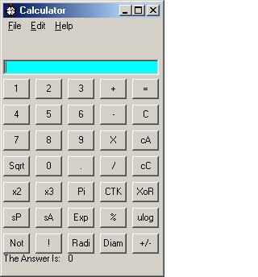



## Calculator Program

### Description

This is a calculator made in VB6. It does a lot of useful functions such as circle area and circumference, support of minus numbers. Addition, subtraction, multiplication and division of numbers. It als does some more advanced functions found on a calculator.

Now fixed the error with division by zero

and added a calculator history with news

about previous versions. Please leave

comments and vote if you like this program.

Now I have made sure the div by 0 error is

fixed! Added some improved code and a few

more things to improve the program. If you

have any problems with this program, please

email me or leave some comments here,

describing the problem. Now added a host of

new functions to the calculator. Sin, Cos

and Tan. Abs function, support for fractions.

There are loads of new features. You can

also store a number in temporary memory as

well.
 
### More Info
 
No additional OCX's are needed

             |
---                |---
**Submitted On**   |2001-04-19 09:23:54
**By**             |[Robin Thomas Benjamin McKay](https://github.com/Planet-Source-Code/PSCIndex/blob/master/ByAuthor/robin-thomas-benjamin-mckay.md)
**Level**          |Intermediate
**User Rating**    |4.3 (13 globes from 3 users)
**Compatibility**  |VB 6\.0
**Category**       |[Data Structures](https://github.com/Planet-Source-Code/PSCIndex/blob/master/ByCategory/data-structures__1-33.md)
**World**          |[Visual Basic](https://github.com/Planet-Source-Code/PSCIndex/blob/master/ByWorld/visual-basic.md)
**Archive File**   |[Calculator186084202001\.zip](https://github.com/Planet-Source-Code/robin-thomas-benjamin-mckay-calculator-program__1-22395/archive/master.zip)

